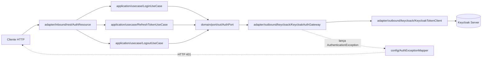
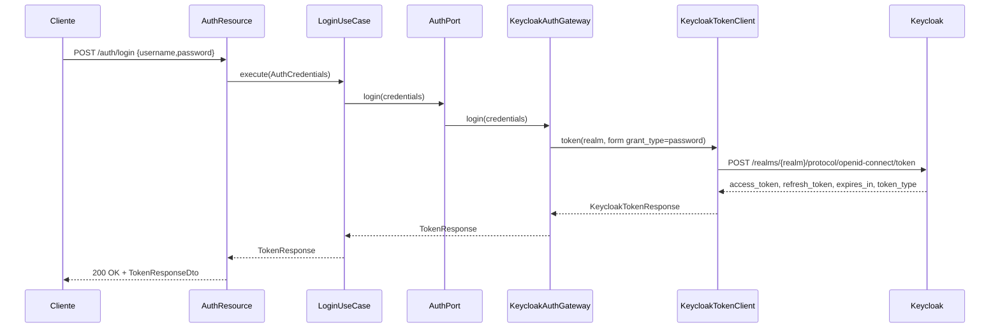
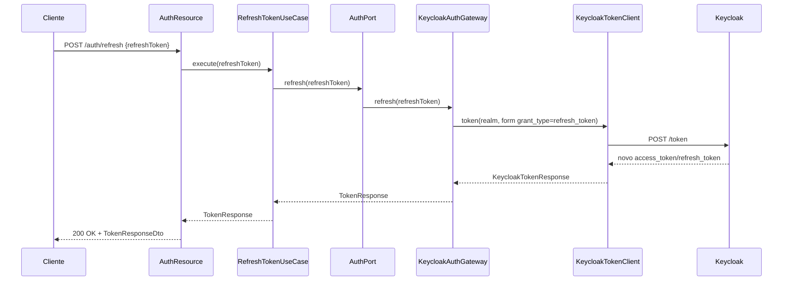
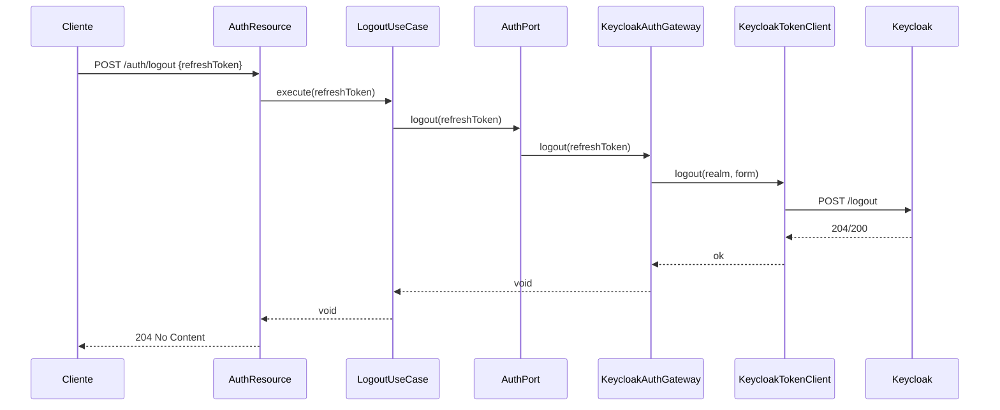
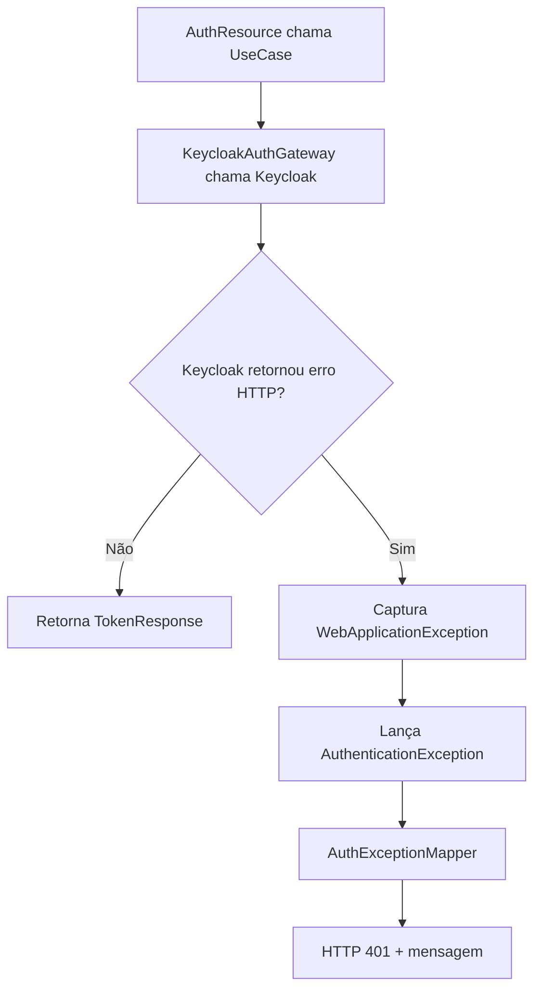

# Microserviço keycloak-auth-service

Este projeto utiliza o Quarkus, o framework Java supersônico e subatômico.

Para saber mais sobre o Quarkus, visite o site: <https://quarkus.io/>.

## O projeto utiliza a versão Java 25
Para instalar via sdk, use o comando:
```shell script
sdk install java  25.0.3-graal
```

Para confirmar a instalação:
```shell script
java --version
```

## Executando o aplicativo em modo de desenvolvimento

Primeiro é necessário criar o arquivo ".env":

```shell script
cp .env.example .env
```

Agora rode o docker para subir os serviços do postgres e keycloak:

```shell script
docker-compose up -d
```

Execute a aplicação no modo de desenvolvimento, que permite a codificação em tempo real, usando:

```shell script
./mvnw quarkus:dev
```

A Aplicação está rodando em: <http://localhost:8081/>

> **_NOTA:_** O Quarkus vem com uma Dev UI, que está disponível apenas no modo de desenvolvimento em <http://localhost:8080/q/dev/>.


## Spotless para padronização de estilo de codificação
Exemplo de uso:

```shell script
user@machine repo % mvn spotless:check
[ERROR]  > The following files had format violations:
[ERROR]  src\main\java\com\diffplug\gradle\spotless\FormatExtension.java
[ERROR]    -\t\t····if·(targets.length·==·0)·{
[ERROR]    +\t\tif·(targets.length·==·0)·{
[ERROR]  Run 'mvn spotless:apply' to fix these violations.
user@machine repo % mvn spotless:apply
[INFO] BUILD SUCCESS
user@machine repo % mvn spotless:check
[INFO] BUILD SUCCESS
```

## Empacotamento e execução da aplicação

A aplicação pode ser empacotada usando:

```shell script
./mvnw package
```

Ela produz o arquivo `quarkus-run.jar` no diretório `target/quarkus-app/`.
Esteja ciente de que não é um _über-jar_, pois as dependências são copiadas para o diretório `target/quarkus-app/lib/`.

A aplicação agora pode ser executada usando `java -jar target/quarkus-app/quarkus-run.jar`.

Se você quiser construir um _über-jar_, execute o seguinte comando:

```shell script
./mvnw package -Dquarkus.package.jar.type=uber-jar
```

A aplicação, empacotada como um _über-jar_, agora pode ser executada usando `java -jar target/*-runner.jar`.

## Criando um executável nativo

Você pode criar um executável nativo usando:

```shell script
./mvnw package -Dnative
```

Ou, se você não tiver o GraalVM instalado, você pode executar a construção do executável nativo em um contêiner usando:

```shell script
./mvnw package -Dnative -Dquarkus.native.container-build=true
```

# Diagramas

## Arquitetura geral (Hexagonal)



---

## Sequência - Login (`POST /auth/login`)



---

## Sequência - Refresh (`POST /auth/refresh`)



---

## Sequência - Logout (`POST /auth/logout`)



---

## Fluxo de erro de autenticação (401)



